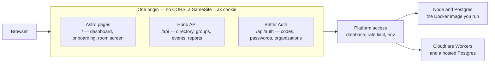

# Architecture

One codebase, two targets, and the rotating token

import { RotatingToken } from "./_components/architecture-diagram";

## One origin, two targets

absqir is one codebase that runs on two targets. Astro renders the pages,
Hono serves the API under `/api`, and both share one origin — so there is
no CORS and the session cookie stays `SameSite=Lax`. The Docker image runs
it on Node.js against your Postgres. The same code deploys to Cloudflare
Workers against a hosted Postgres, which
[Deploy to Cloudflare](/cloudflare) walks through.

Platform access — the database connection, the rate limiter, the environment —
sits behind one small interface, picked per target at build time.

## Accounts

Better Auth handles credentials. Two plugins carry the product rules:

- **Email OTP** sends the 6 digit codes. A code signs an unknown email up,
  signs a known one in, and resets a password.
- **Organization** owns organizations, members, roles, and invitations. The
  roles `owner`, `admin`, `organizer`, and `member` are declared once and
  checked both by Better Auth's own endpoints and by the absqir API.

The sign-up door is a database hook: the first account is the operator,
after that an email needs a pending invitation unless `REGISTRATION_OPEN`
is set. Onboarding state lives on the user row, and the Astro middleware
sends an unfinished account back to onboarding on every page.

## Data model

Better Auth owns `user`, `session`, `account`, `verification`,
`organization`, `member`, and `invitation`. absqir adds:

- `person` — the directory. A row can exist before the person has an
  account, and links to the account when an invitation is accepted. Email
  and identifier are unique inside the organization.
- `group` and `group_member` — teams, divisions, cohorts.
- `schedule` and `schedule_group` — rules that spawn events.
- `attendance_session` and `session_group` — one moment people are expected,
  and which groups.
- `attendance_record` — one row per person per event: status, method,
  time, note. Absent rows are written when the event closes.
- `session_registration` — who signed up through an event's public page.
- `leave_request` — a member asks to be excused; an approval writes an
  excused record.
- `notification` — what one person is told, with a key that makes a repeat
  write a no-op.

Everything an organization owns cascades on delete.

## The rotating QR token and the pass

<RotatingToken />

The room screen encodes a link carrying a token: an HMAC-SHA256 over the
session id and the current 20-second time window, keyed by a per-session
secret that never leaves the server. The screen fetches a fresh token when
the window ends, so a photo of the code expires within seconds, and the
server accepts the current window and the one before it. Only a signed-in
member on the list can check in with it.

The member's pass is the other direction: an HMAC over the session id and
the person id with the same secret. The organizer's scanner reads it and the
server checks the signature before it writes anything. See
[Events and check-in](/sessions).

## Security posture

- Strict security headers and a `default-src 'none'` CSP on the API.
- Same-origin CSRF policy, 64 KB body limit, per-IP rate limit.
- Codes, sign-in, and password resets carry their own tighter rate limits,
  keyed by the client IP the edge or the reverse proxy reports.
- Errors return a request id, never the internal message.
- The email lookup on the sign-in page reveals whether an email has an
  account. That trade is deliberate, the same one Slack and Notion make.
