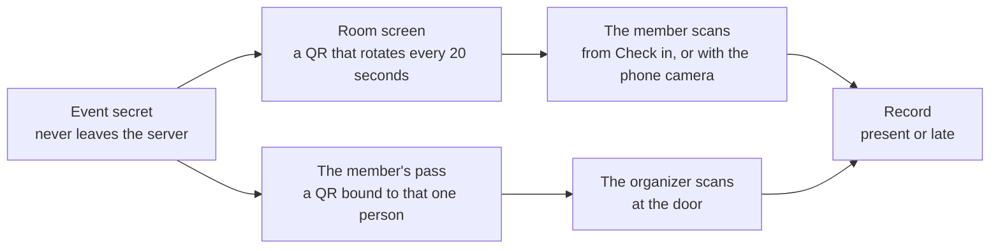

# Events and check-in

The clock, the two doors, schedules, and leave requests

import { EventClock } from "./_components/event-diagram";

An event is one moment people are expected: a shift, a meeting, a
workshop, a community day. It has a start, an end, a late threshold, and
one or more groups. Everyone in those groups is on the list.

## The list

**Events** shows a grid of cards, twelve at a time, with **Upcoming**
soonest first and **Past** newest first. **Load more** adds the next
twelve. The search box matches a piece of the title, and the group filter
keeps the events that expect that group. The tab, the search and the
group stay in the address, so a link opens the same view.

The API answers `GET /api/events` with `items` and a `nextCursor`. Send
the cursor back as `cursor` for the next page. The cursor is where the
previous page ended, so page fifty costs the database what page one does.

## The event clock

An event moves through three statuses on its own. Nothing is stored; the
status is read from the timestamps every time.

<EventClock />

| Status      | When                                                                                                                |
| ----------- | ------------------------------------------------------------------------------------------------------------------- |
| `scheduled` | Before check-in opens.                                                                                              |
| `running`   | From `opens before` minutes ahead of the start until the end, or from the moment an organizer presses **Open now**. |
| `done`      | At the end, or when an organizer presses **Close now**.                                                             |

When an event becomes done, every expected person without a record gets an
`absent` record. That happens on the next read after the end, or at once on
a manual close, so no cron job is required.

An event can be created with times that already passed, to record something
that happened before it was written. It closes on the next read and marks
everyone expected absent, so fix the records afterwards. The dialog warns
before you save, and the organizers get no closed notification for it.

## Statuses per person

| Status    | How it happens                                                             |
| --------- | -------------------------------------------------------------------------- |
| `present` | Checked in no later than `late after` minutes past the start.              |
| `late`    | Checked in after that, while the event still runs.                         |
| `excused` | Set by an organizer by hand, or written when a leave request is approved.  |
| `absent`  | Written when the event closes, for everyone expected who never checked in. |

An organizer can change any status by hand from the event page. The record
remembers how it came to be: `screen`, `scanner`, `manual`, or `auto`.

## Two ways to check in

Both codes are signed with the same per-event secret, so both are checked by
the server before anything is written. Either way, the clock decides present
or late.

**The room screen.** The organizer opens the event's room screen on a
projector or a tablet. It shows a QR code that encodes a link with a token.
The token is an HMAC over the event id and the current 20 second window,
keyed by a per-event secret that never leaves the server, so a photo of
the code expires within seconds. A member scans it from **Check in** in the
app, which opens the camera, or with the phone camera, which opens the link
and signs the member in if the phone asks. Only a signed-in member of the
organization can use the link, and only if they are on the list, unless the
event allows walk-ins.

**The scanner at the door.** Each member has a pass for the event on
**Check in** and on **My events**: a QR code signed with the event
secret and bound to that person. The organizer opens the scanner page,
points the camera at the pass, and the person is in. A pass can be pasted
as text when the camera is not available.

Either way, the clock decides present or late. A second scan of the same
person changes nothing and says so.

## Checking where people are

:::warning[Experimental]
Location is new and still being proven in the field. The thresholds, the
signals, and the weights behind them can all change in a later release, so
treat a flagged check-in as a prompt to look, never as a verdict. Do not
make a payroll or a disciplinary decision on this alone.
:::

An organizer can attach a **place** to an event, or to a schedule, and have
absqir refuse a check-in made somewhere else. Places live under
**Settings > Places**: a point on a map, a radius, and a name. An event
copies the circle when it is created, so moving or deleting a place later
never changes what a past check-in was judged against.

Tick **Refuse a check-in made outside this place** on the event or the
schedule to switch the check on. Without a place the tick does nothing,
because there is no circle to be outside of. A member's browser is asked for
its location only when an event asks, so an event with no place raises no
permission prompt.

### What it can and cannot do

A web page cannot tell a real satellite fix from a made-up one. A fake-GPS
app on Android writes the system mock-location provider, and the browser
hands the page an ordinary looking reading with no mark on it. An override
made through the developer tools sits below the page entirely.

So the place is not what proves attendance. The rotating code on the room
screen is: to hold a valid token you had to see the live screen, and no
amount of faked location produces one. The place closes the one gap that
code leaves, which is the member who photographs the screen and sends it to
a friend across town.

### What the server checks

Only the distance refuses a check-in. Every other signal accepts it and
flags the record for the organizer:

| Signal              | What it means                                                                                             |
| ------------------- | --------------------------------------------------------------------------------------------------------- |
| Distance            | Outside the circle, with the device's own margin of error allowed for. This is the only one that refuses. |
| A frozen reading    | Several readings named the same spot to the half metre. A real receiver wanders.                          |
| No altitude         | No reading carried one, so none came from satellites.                                                     |
| A round accuracy    | Every reading claimed the same whole number of metres.                                                    |
| The device clock    | It belongs to a different part of the world from the place.                                               |
| The network address | It resolves far from the claimed spot, or to a VPN or hosting provider.                                   |
| A jump              | Too far from that person's last check-in to have travelled in the time.                                   |
| A copied position   | Another person sent the very same coordinates.                                                            |

Each one is weak alone and cheap to defeat alone. Together, and repeated
across every event a person attends, they leave a pattern that is tiring to
fake.

Flagging rather than refusing is deliberate. A soft signal that locks a door
falls on the member indoors with an old phone far more often than on the one
person gaming it, and the cheat can try again while the honest member
cannot.

### When the check is wrong

The place check is the one rule in absqir that can refuse somebody who did
everything right. A phone that will not settle, a basement meeting room, an
old receiver: the member scanned the live code on the room screen and was
still turned away.

So a refused member gets a button, **I am here, tell the organizer**, which
opens a short form. The report reaches **Check-in problems** in the sidebar,
where an organizer reads it beside the evidence already on record: how far
the reading was, how vague, what the signals said, how many reports that
person has sent before, and the line that usually settles it — whether they
held a live code from the room screen. They always did, because the code is
checked before the place is.

Sending a report notifies every organizer, admin, and owner, and the
decision notifies the member, so neither side has to watch a queue.

Approving records **the time of the refused scan**, never the moment of the
decision, so nobody is marked late for how long a report waited.

The status is the organizer's to choose: present, late, or excused. The
clock's own answer is preselected and labelled, and an organizer who watched
the member walk in on time can overrule it. That is the common case: someone
arrives at 08:55, fights their phone until 09:12, and the clock alone would
call them late.

Declining leaves the record as it is. Either way the member sees the outcome
on their own event page and gets a notification.

One report per person per event. A member who already reported sees what
became of it instead of the button, so nobody writes out a second report
only to have the send refused. A declined report is final: the event stays
as it is, and an organizer who changes their mind marks the person by hand
from the event page.

### Reviewing a flag

A flagged check-in shows in the event's **Where** column. Open it to read
the reasons, then either clear the flag, which records that somebody looked
and let it stand, or mark the person absent from the row menu. The signals
are never erased.

Every attempt, accepted or refused, is kept. One refusal is a member in the
wrong place. Thirty across a term, each a little nearer the circle, is
somebody finding the line.

:::note
The map needs tiles. Out of the box it uses OpenStreetMap, which asks for no
account and no key. Set `PUBLIC_MAP_TILE_URL` and
`PUBLIC_MAP_TILE_ATTRIBUTION` to your own tile server before you put real
traffic through it.
:::

## Schedules

A schedule is a rule: every weekday at 09:00 for 60 minutes, or every
Tuesday at 19:00. It carries its own late threshold, opening margin, groups,
and timezone, and spawns events two weeks ahead. The events appear when
anyone lists them, so a fresh rule shows its first events at once. Editing
a rule replaces the future events nobody has touched; the ones that ran
stay as they were.

## Public registration

An event can open a public page. Tick **Open a public page where anyone
can register** on the event, set a seat limit or leave it empty, and copy
the link from the event page. The link looks like `/e/<event id>`.

The page works signed out. It shows the title, the times, the organization,
and how many seats are taken. A visitor who registers:

- signs in, or creates an account with a code sent to their email,
- joins the organization as a `member` if they are not one yet, with a
  directory row,
- lands on the event's list, so the event expects them like anyone in
  a group.

A stranger can create an account through this page even when
`REGISTRATION_OPEN` is off. The page sets a short-lived cookie with the
event id, and the sign-up door accepts a new email only while that cookie
names an event that still takes people. An event takes people until it
ends, or until an organizer unticks the box.

A registered person can withdraw before the event opens. On the event
page, registered people carry a **Registered** label. The expected count
and the absent records at close include them.

## Leave requests

A member who cannot make an event asks for leave on **My leave** before
the event ends: pick the event, give a reason, send. One request per
event. A pending request can be withdrawn.

Organizers, admins, and owners see the queue on **Leave requests**. An
approval writes an `excused` record for that event with the note, so the
close does not mark the person absent. A decline leaves the record as it
is. Either way, the member sees the decision and the note on **My leave**.
A decided request cannot be changed; an organizer who changes their mind
sets the status by hand on the event page.

## For members

**Home** is a member's front page. The panel at the top shows the event
that runs now, or the next one: its times, its groups, and the **Check
in** and **My pass** buttons while it runs, or the moment check-in opens.
Under it, **Coming up** lists the next days as an agenda, and **Your
standing** shows the attendance rate with a bar split into present, late,
excused and absent, then the last five records. A small **Leave** card
says what waits for a decision. The header names the time zone the page
reads in, with a link to change it. There is no clock: the device has one.

**Check in** is the way in: the camera reads the room screen, and the
events that run right now show a pass for the door.

**My events** is a grid of cards like the organizer's, twelve at a time,
with **Upcoming** and **Past** tabs and **Load more**. Each card carries
the event, its groups, and your side of it: the record once you have one,
the pass while it runs, or when the door opens. `GET /api/my/events`
answers with `items` and a `nextCursor`, and takes `scope`, `cursor` and
`limit` like the organizer's list. Each item also carries `leave`, your
request for that event if you sent one, and a `note` on the record when
an organizer wrote one.

A click on a card, or on a row of **Coming up** on the home page, opens
the event's details in place: when the door opens, when late starts, the
groups, and your side of it. Under the rule sits your record with the
organizer's note, or your leave request with its status and a **Withdraw**
button while it waits. The actions fit the moment: **Check in** and **My
pass** while the event runs, and **Ask for leave** on an event ahead of
you that has no record and no request. That button opens the leave form
with the event already chosen.

**My leave** shows the requests that wait for a decision first, then a
rule that says **Decided**, then the answered ones newest first as cards,
twelve at a time with **Load more**. `GET /api/my/leave` takes `status`
(`pending`, `decided`, `all`), `cursor` and `limit`.

**History** lists every closed event with your status and an attendance
rate. Nobody else in the organization sees your history page.

## Time zones

Events carry absolute instants. Each account chooses the zone it reads
them in, on **Settings → Profile → Time zone**. Every time in the app then
shows in that clock, and the reminders that account receives are worded in
it. Without a choice, the app follows the device. Two people in different
places see the same moment in their own clock, so they can agree on it.

`PATCH /api/me/timezone` stores an IANA name such as `Asia/Jakarta`, or
`null` to follow the device again. `GET /api/me` returns it as `timezone`.
