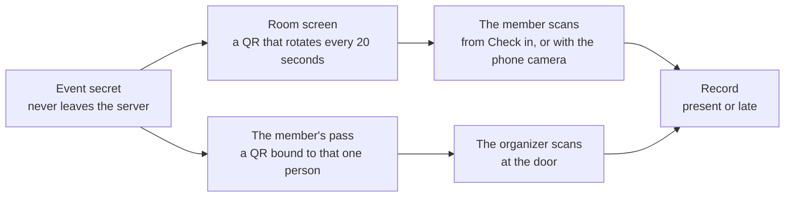

# Events and check-in

The clock, the two doors, schedules, and leave requests

import { EventClock } from "./_components/event-diagram";

An event is one moment people are expected: a shift, a meeting, a
workshop, a community day. It has a start, an end, a late threshold, and
one or more groups. Everyone in those groups is on the list.

## The list

**Events** shows a grid of cards, twelve at a time, with **Upcoming**
soonest first and **Past** newest first. **Load more** adds the next
twelve. The search box matches a piece of the title, and the group filter
keeps the events that expect that group. The tab, the search and the
group stay in the address, so a link opens the same view.

The API answers `GET /api/events` with `items` and a `nextCursor`. Send
the cursor back as `cursor` for the next page. The cursor is where the
previous page ended, so page fifty costs the database what page one does.

## The event clock

An event moves through three statuses on its own. Nothing is stored; the
status is read from the timestamps every time.

<EventClock />

| Status      | When                                                                                                                |
| ----------- | ------------------------------------------------------------------------------------------------------------------- |
| `scheduled` | Before check-in opens.                                                                                              |
| `running`   | From `opens before` minutes ahead of the start until the end, or from the moment an organizer presses **Open now**. |
| `done`      | At the end, or when an organizer presses **Close now**.                                                             |

When an event becomes done, every expected person without a record gets an
`absent` record. That happens on the next read after the end, or at once on
a manual close, so no cron job is required.

An event can be created with times that already passed, to record something
that happened before it was written. It closes on the next read and marks
everyone expected absent, so fix the records afterwards. The dialog warns
before you save, and the organizers get no closed notification for it.

## Statuses per person

| Status    | How it happens                                                               |
| --------- | ---------------------------------------------------------------------------- |
| `present` | Checked in no later than `late after` minutes past the start.                |
| `late`    | Checked in after that, while the event still runs.                         |
| `excused` | Set by an organizer by hand, or written when a leave request is approved.    |
| `absent`  | Written when the event closes, for everyone expected who never checked in. |

An organizer can change any status by hand from the event page. The record
remembers how it came to be: `screen`, `scanner`, `manual`, or `auto`.

## Two ways to check in

Both codes are signed with the same per-event secret, so both are checked by
the server before anything is written. Either way, the clock decides present
or late.

**The room screen.** The organizer opens the event's room screen on a
projector or a tablet. It shows a QR code that encodes a link with a token.
The token is an HMAC over the event id and the current 20 second window,
keyed by a per-event secret that never leaves the server, so a photo of
the code expires within seconds. A member scans it from **Check in** in the
app, which opens the camera, or with the phone camera, which opens the link
and signs the member in if the phone asks. Only a signed-in member of the
organization can use the link, and only if they are on the list, unless the
event allows walk-ins.

**The scanner at the door.** Each member has a pass for the event on
**Check in** and on **My events**: a QR code signed with the event
secret and bound to that person. The organizer opens the scanner page,
points the camera at the pass, and the person is in. A pass can be pasted
as text when the camera is not available.

Either way, the clock decides present or late. A second scan of the same
person changes nothing and says so.

## Schedules

A schedule is a rule: every weekday at 09:00 for 60 minutes, or every
Tuesday at 19:00. It carries its own late threshold, opening margin, groups,
and timezone, and spawns events two weeks ahead. The events appear when
anyone lists them, so a fresh rule shows its first events at once. Editing
a rule replaces the future events nobody has touched; the ones that ran
stay as they were.

## Public registration

An event can open a public page. Tick **Open a public page where anyone
can register** on the event, set a seat limit or leave it empty, and copy
the link from the event page. The link looks like `/e/<event id>`.

The page works signed out. It shows the title, the times, the organization,
and how many seats are taken. A visitor who registers:

- signs in, or creates an account with a code sent to their email,
- joins the organization as a `member` if they are not one yet, with a
  directory row,
- lands on the event's list, so the event expects them like anyone in
  a group.

A stranger can create an account through this page even when
`REGISTRATION_OPEN` is off. The page sets a short-lived cookie with the
event id, and the sign-up door accepts a new email only while that cookie
names an event that still takes people. An event takes people until it
ends, or until an organizer unticks the box.

A registered person can withdraw before the event opens. On the event
page, registered people carry a **Registered** label. The expected count
and the absent records at close include them.

## Leave requests

A member who cannot make an event asks for leave on **My leave** before
the event ends: pick the event, give a reason, send. One request per
event. A pending request can be withdrawn.

Organizers, admins, and owners see the queue on **Leave requests**. An
approval writes an `excused` record for that event with the note, so the
close does not mark the person absent. A decline leaves the record as it
is. Either way, the member sees the decision and the note on **My leave**.
A decided request cannot be changed; an organizer who changes their mind
sets the status by hand on the event page.

## For members

**Home** is a member's front page. The panel at the top shows the event
that runs now, or the next one: its times, its groups, and the **Check
in** and **My pass** buttons while it runs, or the moment check-in opens.
Under it, **Coming up** lists the next days as an agenda, and **Your
standing** shows the attendance rate with a bar split into present, late,
excused and absent, then the last five records. A small **Leave** card
says what waits for a decision. The header names the time zone the page
reads in, with a link to change it. There is no clock: the device has one.

**Check in** is the way in: the camera reads the room screen, and the
events that run right now show a pass for the door.

**My events** is a grid of cards like the organizer's, twelve at a time,
with **Upcoming** and **Past** tabs and **Load more**. Each card carries
the event, its groups, and your side of it: the record once you have one,
the pass while it runs, or when the door opens. `GET /api/my/events`
answers with `items` and a `nextCursor`, and takes `scope`, `cursor` and
`limit` like the organizer's list. Each item also carries `leave`, your
request for that event if you sent one, and a `note` on the record when
an organizer wrote one.

A click on a card, or on a row of **Coming up** on the home page, opens
the event's details in place: when the door opens, when late starts, the
groups, and your side of it. Under the rule sits your record with the
organizer's note, or your leave request with its status and a **Withdraw**
button while it waits. The actions fit the moment: **Check in** and **My
pass** while the event runs, and **Ask for leave** on an event ahead of
you that has no record and no request. That button opens the leave form
with the event already chosen.

**My leave** shows the requests that wait for a decision first, then a
rule that says **Decided**, then the answered ones newest first as cards,
twelve at a time with **Load more**. `GET /api/my/leave` takes `status`
(`pending`, `decided`, `all`), `cursor` and `limit`.

**History** lists every closed event with your status and an attendance
rate. Nobody else in the organization sees your history page.

## Time zones

Events carry absolute instants. Each account chooses the zone it reads
them in, on **Settings → Profile → Time zone**. Every time in the app then
shows in that clock, and the reminders that account receives are worded in
it. Without a choice, the app follows the device. Two people in different
places see the same moment in their own clock, so they can agree on it.

`PATCH /api/me/timezone` stores an IANA name such as `Asia/Jakarta`, or
`null` to follow the device again. `GET /api/me` returns it as `timezone`.
