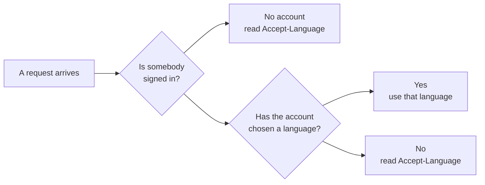

# Language

<div role="doc-subtitle">Two languages, one per account, chosen on the first run</div>

absqir speaks English and Bahasa Indonesia. The choice belongs to the
account, not to the instance: two people in one organization can read the
same event in different languages, and each one gets their notifications and
their email in the language they chose.

## What decides the language



Before anybody signs in, absqir reads two things: a cookie this browser
carries, and then the `Accept-Language` header. A phone set to Bahasa
Indonesia opens the sign-in page in Bahasa Indonesia, with nothing to press
first. A browser that asks for a language absqir does not speak gets
English.

After sign-in, the account decides. The stored choice wins over both, so the
same account reads the same language on a borrowed laptop.

The cookie is how the sign-in page keeps up. An account that has chosen a
language leaves that choice on the browser as it reads, so the door speaks
it the next time the same person arrives, before there is any session to
ask. Signing out does not clear it.

## Where the reader chooses

Everybody meets the picker once, on the first step of onboarding, beside
their name. The owner who starts an organization and the member who arrives
from an invitation both pass through that step, so both make the choice
before they reach anything else. The picker opens on the language the
browser asked for, so a reader who agrees with it only presses Continue.

Afterwards the same picker sits in **Settings**, under **Preferences**, above
the theme. Choose a language and press **Save**. The page reloads in the new
language.

Each language names itself in the list, English as "English" and Bahasa
Indonesia as "Bahasa Indonesia", so a reader who cannot read the language on
screen still finds theirs.

## What is translated

| Surface                     | Language                                           |
| --------------------------- | -------------------------------------------------- |
| Every page and every dialog | The reader's                                       |
| Field errors and refusals   | The reader's                                       |
| API answers                 | The account that called, or the browser that asked |
| Notifications               | The reader's, worked out as they open the list     |
| Email                       | The reader of that message                         |
| The documentation you read  | English only                                       |

Dates and numbers follow the language too. English writes `1,234.5` and
`Mon 14 Sep`; Bahasa Indonesia writes `1.234,5` and `Sen 14 Sep`. Distances,
percentages and counts all read that way, so nothing on a screen is half
translated.

A notification keeps the message it was written from rather than the
sentence, so changing your language changes the list you already have.
Somebody's own words inside one, a leave reason or an organizer's note, stay
exactly as they were typed. A row written before this version keeps the
sentence it was written with.

An invitation often reaches an address with no account, and so with no
choice of its own. absqir uses the language of that address when it has an
account, and the language of the browser that pressed **Send** when it does
not.

Dates, times and numbers follow the reader's language as well. The time zone
is a separate choice on the same settings page: see
[Accounts and organizations](/accounts).

## What an operator has to do

Nothing. Both languages ship in the build, and no key or service is
involved. A self-host gets the picker the moment it runs this version.

Two migrations add the column that holds the choice and the keys a
notification is worded from. An instance that applies migrations on start
needs nothing; an instance that runs them by hand runs:

```bash
npx absqir migrate
```

An account that existed before the upgrade has chosen nothing, so it reads
in whatever its browser asks for until somebody picks a language.

## Adding a language

The messages live in `packages/i18n`, one file per area, one folder per
language:

```
packages/i18n/src/messages/
  en/          # English carries every key
  id/          # Bahasa Indonesia mirrors it
```

:::steps

### Copy the English folder

Copy `src/messages/en` to a folder named after the new language tag, then
translate the values. Leave the keys alone.

### Name the language

Add the tag to `LOCALES` in `src/locales.ts`, and give it a name, a tagline,
and a formatting tag beside the two that are there.

### Add it to the catalog

Import the new folder in `src/messages/index.ts`, and add the tag to the
`resources` map in `src/index.ts`.

:::

A test compares every language against English and fails the build when a
key is missing on either side, so a half-finished translation cannot ship
quietly. English is the fallback: a message a translator has not reached yet
reads in English rather than showing its key.
