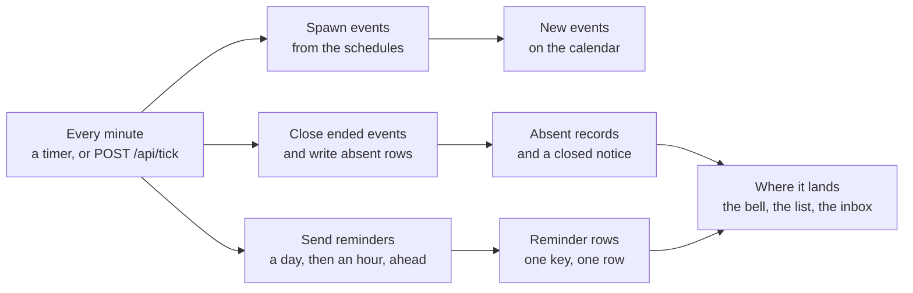

# Notifications and reminders

<div role="doc-subtitle">What absqir sends, where it lands, and the heartbeat</div>

Everything that concerns a person lands in one list, at **Notifications**.
The bell in the header says how many wait. A click on the bell opens the
newest few in place, with a link to the full list. With a mouse, the bell
opens when the pointer rests on it.

The bell stays current without a reload. The page holds a stream from the
server, `GET /api/notifications/stream`, which sends the unread count and
every new row as server-sent events. The server asks the database every 5
seconds, so a new notification shows within that time on Node and on
Cloudflare alike. A browser that loses the stream falls back to a poll once
a minute.

## What absqir sends

| Type              | Who gets it                    | When                                                    |
| ----------------- | ------------------------------ | ------------------------------------------------------- |
| Event reminder    | Everyone expected, with an account | The day before, and again within the hour before the start, worded in the reader's own time zone. |
| Leave requested   | Organizers, admins, owners     | A member asks to be excused.                            |
| Leave decided     | The member who asked           | An organizer approves or declines.                      |
| Event closed      | Organizers, admins, owners     | An event closes, with the counts. Not for an event created after it ended.   |

A person without an account gets nothing: a directory row on its own has
nowhere to receive. An event created less than two hours before it starts
sends the hour reminder only, never both at once.

Each notification is written once. The row carries a key made of what it is
about, so a heartbeat that runs every minute still sends one reminder, not
sixty.

## Where they go

Each account chooses where notifications reach it, in **Settings**, under
**Notifications**:

| Choice        | The bell and the list | Email                     |
| ------------- | --------------------- | ------------------------- |
| App and email | Yes                   | Reminders and leave       |
| App only      | Yes                   | No                        |
| Email only    | No                    | Reminders and leave       |
| Off           | No                    | No                        |

The default is app and email. The choice applies to what is written from
then on: each row copies it at write time, so a later change never
rewrites history. An email-only row is still written, so the dedupe key
still holds and one reminder stays one reminder. It just never shows in the
app. With **Off**, nothing is written at all.

## Email

Email goes out when the instance has a `RESEND_API_KEY`, for reminders,
leave requests and leave decisions, and only to accounts whose choice
includes email. A closing stays in the app, where the organizer is already
looking.

Set `APP_URL` to the address people type. Links in an email point there, and
a reminder sent by the heartbeat has no request to read an origin from.

## The heartbeat

Three jobs run on the clock: schedules spawn their events, ended events
close and write their absent rows, and reminders go out.



Reading a page settles the organization it belongs to, so a small instance
needs no scheduler at all. The heartbeat only makes the same work eager, so a
reminder arrives while nobody is looking.

Reading a page settles the organization it belongs to, so a small instance
needs no cron at all. The heartbeat only makes the work eager, so a reminder
arrives while nobody is looking.

**Docker and Node.** The server runs the heartbeat itself, once a minute.
Nothing to configure.

**Cloudflare Workers.** A Worker holds no timer between requests, so an
outside scheduler calls the endpoint. Set `CRON_SECRET` to a long random
string, then call it:

```bash
curl -X POST https://absqir.example.com/api/tick \
  -H "authorization: Bearer $CRON_SECRET" \
  -H "content-type: application/json" \
  -d '{}'
```

The `content-type` header matters: without it the site treats the call as a
cross-site form post and refuses it. The route answers `404` while
`CRON_SECRET` is unset, and `401` when the token is wrong. The answer says
how many organizations it settled and how many notifications it wrote.

Any scheduler works: a Cloudflare Cron Trigger, a cron entry on a server, a
systemd timer. Once a minute is plenty; once every five minutes still puts
the hour reminder inside its window.
